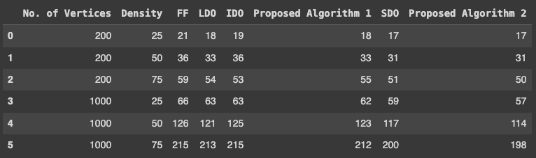
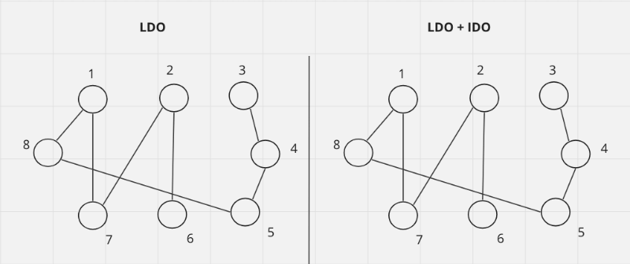
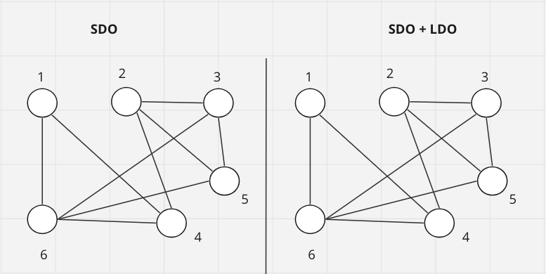

# Воспроизведение результатов статьи о новых алгоритмах раскраски графов

## Суть

В статье представлены два новых эвристических алгоритма раскраски графов, основанных на известных эвристических алгоритмах.
Один из них является модификацией алгоритма упорядочения по наибольшей степени (LDO - Largest Degree Ordering), а
другой - модификацией алгоритма упорядочения по степени насыщения (SDO - Saturated Degree Ordering). 

Первый алгоритм работает как LDO, но когда есть две вершины, имеющие одинаковую степень, IDO использовался для выбора между ними.
Аналогично первому, второй алгоритм работает как SDO, но когда есть две вершины с одинаковой степенью, то рассматривается вершина с большей степенью LDO.

Новые алгоритмы были сравнены с точки зрения используемых цветов с известными алгоритмами LDO, FF (First fit) - жадный алгоритм, SDO, IDO.

## Воспроизведение

Были воспроизведены алгоритмы, описанные в статье LDO, FF, SDO, IDO, с которыми сравниваются два новых. 
Также были воспроизведены два новых алгоритма LDO + IDO, SDO + LDO.

В статье для сравнения берутся рандомные графы с разной плотностью (25%, 50%, 75%), а также с разным количеством вершин (200, 1000) 
и затем сравниваются по количеству использованных цветов для раскраски.

Таблица с результатами: 

### Пример, как отличаются первый предложенный алгоритм (LDO + IDO) от того, на котором он основан (LDO):

### Пример, как отличаются второй предложенный алгоритм (SDO + LDO) от того, на котором он основан (SDO):

## Вывод
Результаты воспроизвести удалось.
Количество цветов, использованных в повторенных алгоритмах очень похожи на результаты, представленные в статье.

